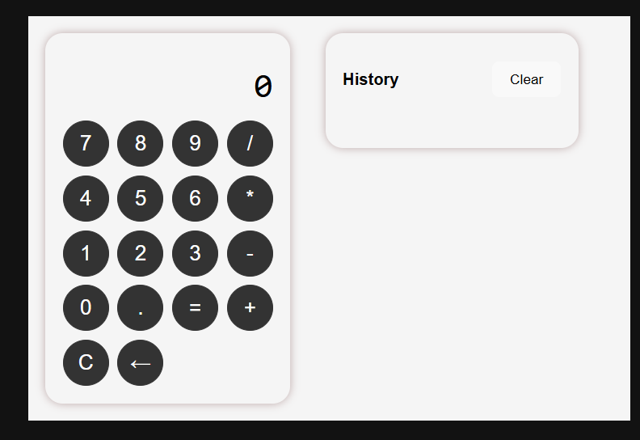
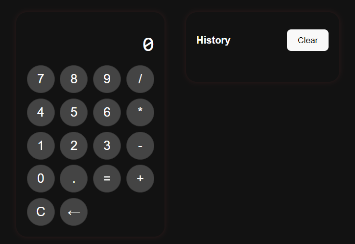
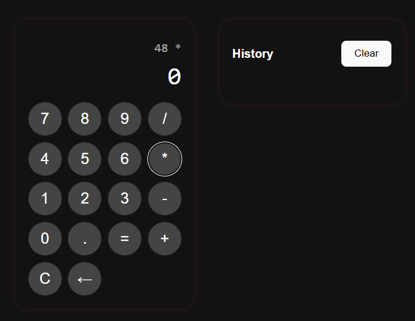
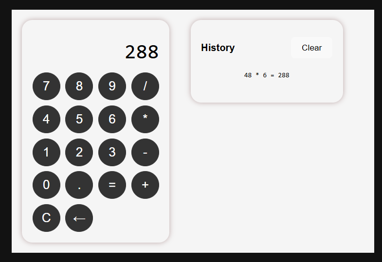
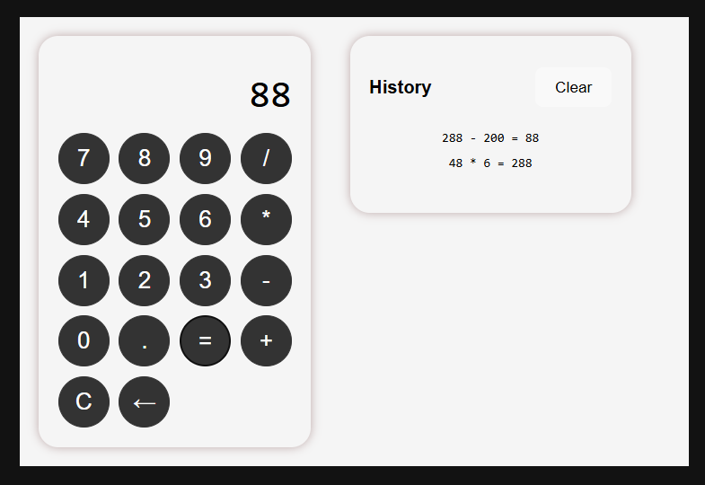

🧮 iOS-Style Calculator App
A beautiful, accessible, responsive calculator built with React 18 and Redux Toolkit, inspired by the iOS calculator UI. Features include arithmetic operations, keyboard support, calculation history, and dark mode toggle (optional).

ScreenShots

🛠️ Tech Stack
React 18
Redux Toolkit
javaScript
CSS Modules or Plain CSS
Jest + React Testing Library for unit and flow tests

🚀 Features
iOS-like calculator UI
Arithmetic operations: + - × ÷
Keyboard input support
Error handling (divide by 0, max digits, etc.)
Calculation history panel with clear button
Clear all and backspace support
Responsive design (mobile-first)

📦 Project Structure

calculator-app/
├── public/
├── src/
│   ├── assets/
│   ├── components/
│   │   ├── Button.jsx
│   │   └── Keypad.jsx
│   ├── redux/
│   │   └── calculatorSlice.ts
│   ├── __tests__/
│   │   ├── calculatorSlice.test.js
│   │   └── App.test.js
│   ├── App.jsx
│   ├── App.css
│   └── main.tsx
├── README.md
├── package.json

1. Clone the Repository
Clone Raphik Branch
git clone -b Raphik https://github.com/sadmalearn/reactCalculator.git
cd calculator-app

2. Install Dependencies
npm install

3. Run
npm run dev

🔍 Keyboard Support
Key	Action
0–9	Enter digit
+ - * /	Operations
Enter or =	Calculate result
Backspace or ←	Delete digit
C	Clear current entry

